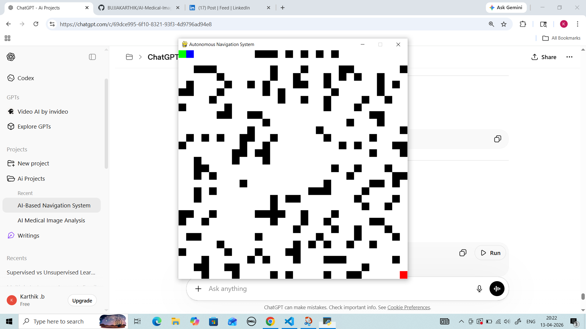
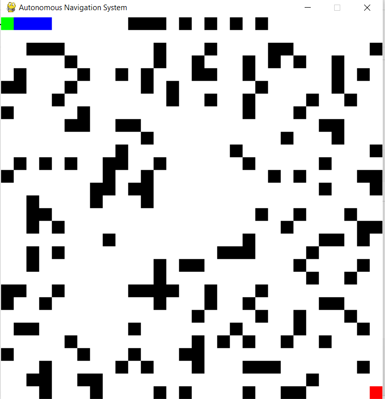
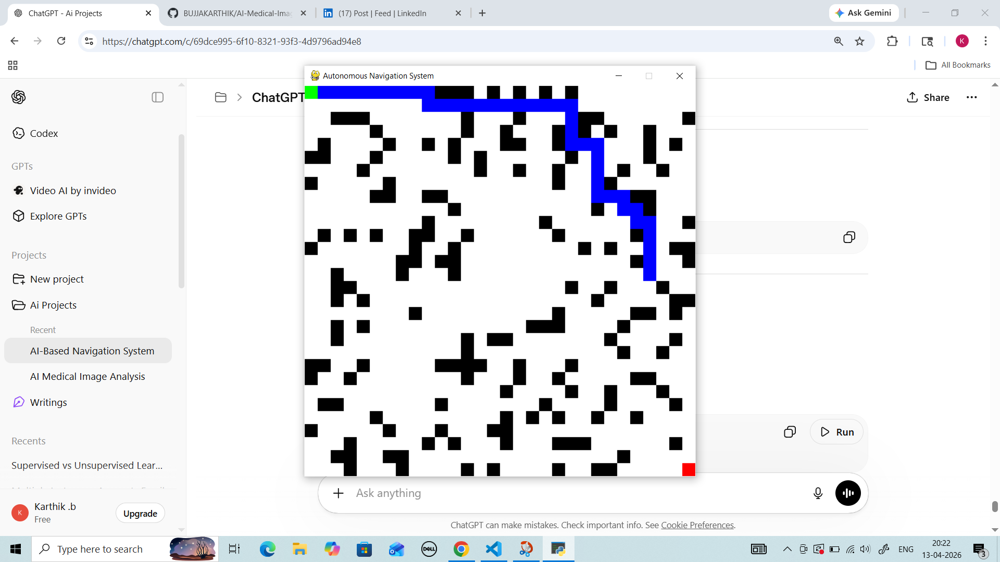
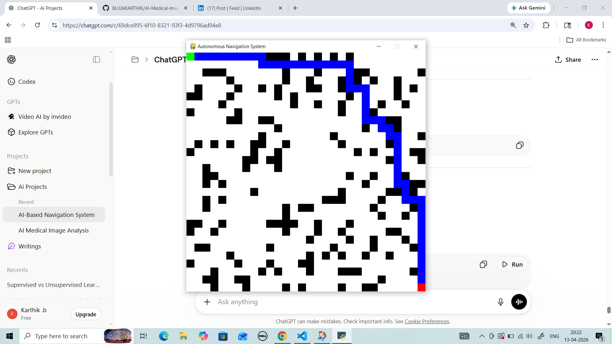

# 🚗 AI-Based Autonomous Navigation System

## 📌 Overview
This project demonstrates an AI-based autonomous navigation system using a grid-based simulation.  
The system intelligently finds the shortest path from start to goal while avoiding obstacles using the A* algorithm.

---

## 🧠 Key Features
- Autonomous path planning (A* algorithm)
- Obstacle avoidance
- Real-time simulation using Pygame
- Dynamic environment with random obstacles

---

## 🛠️ Tech Stack
- Python
- Pygame
- NumPy

---

## ▶️ How to Run
```bash
python src/main.py

## 🖼️ Project Screenshots

### 🟢 Initial Grid


### ⬛ Obstacles


### 🔵 Path Planning


### ✅ Final Output

